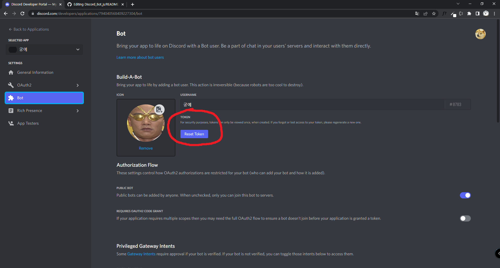

# Discord_Bot

[디스코드 봇 생성하는 곳](https://discord.com/developers/applications)

1. 위에 링크에 들어가 봇을 만들고, TOKEN을 복사해 config.py에 붙여넣기

2. 봇의 CLIENT_ID를 복사해, 아래 링크 [client_id] 자리에 넣어 접속하기

https://discord.com/oauth2/authorize?client_id=[client_id]&permissions=8&scope=bot

3. 원하는 방에 봇을 참가시키기

4. bot.py 실행하기

---

## 봇 생성 페이지 중요 사항들 위치

### TOKEN

### CLIENT_ID

### Privileged Gateway Intents
- 채팅을 읽으려면 MESSAGE CONTENT INTENT 체크 필요

---

## 읽기 자료

### discord.py

[Home Page]()

[Quick Start](https://discordpy.readthedocs.io/en/stable/quickstart.html)

[discord.ext.commands.Bot](https://discordpy.readthedocs.io/en/stable/ext/commands/api.html#bots)

### 명령어와 일반 메세지 처리 동시에 적용하기
[is-it-possible-to-use-on-message-and-client-command-in-the-same-code](https://stackoverflow.com/questions/62150817/is-it-possible-to-use-on-message-and-client-command-in-the-same-code)