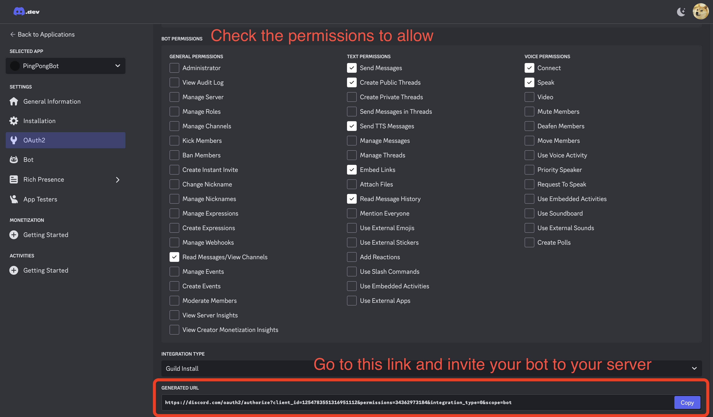

# Discord_Bot

[See Discord.py Guide](https://discordpy.readthedocs.io/en/stable/discord.html)

[Where to create a Discord bot](https://discord.com/developers/applications)

1. Go to the link above to create a bot, copy the [TOKEN](https://github.com/star14ms/Discord_Bot#token) and paste it into config.py. ([MESSAGE CONTENT INTENT](https://github.com/star14ms/Discord_Bot#privileged-gateway-intents) Must be checked!)

2. Generate Invite URL [Location](https://github.com/star14ms/Discord_Bot#invite-url-generator)

3. Invite your bot to your desired server

4. Run main.py

---

## File Description

`main.py` - Bot starts when run (bot TOKEN required)

`bot_base/command.py` - Where to set bot commands

`bot_base/event.py` - Where to set up bot events

`persona/__init__.py` - Where to apply the bot’s persona

`persona/*.py` - Bot personas

`utils.py` - Functions to use when needed

---

## Location of important information on bot creation page

### TOKEN

### Privileged Gateway Intents
- MESSAGE CONTENT INTENT check required to read chat

### Invite URL Generator

---

## Reading Materials

### discord.py

- [Home Page](https://discordpy.readthedocs.io/en/stable/index.html)

- [Quick Start](https://discordpy.readthedocs.io/en/stable/quickstart.html)

- [discord.ext.commands.Bot](https://discordpy.readthedocs.io/en/stable/ext/commands/api.html#bots)

### Apply commands and general message processing simultaneously
- [is-it-possible-to-use-on-message-and-client-command-in-the-same-code](https://stackoverflow.com/questions/62150817/is-it-possible-to-use-on-message-and-client-command-in-the-same-code)
